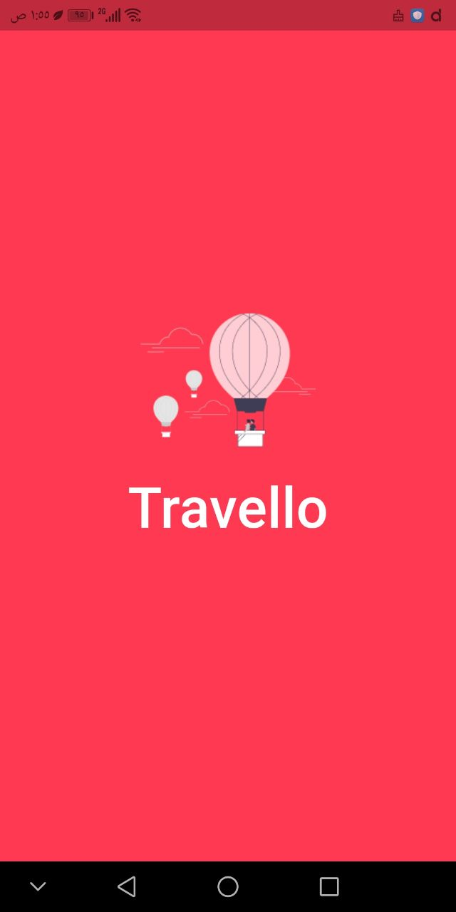
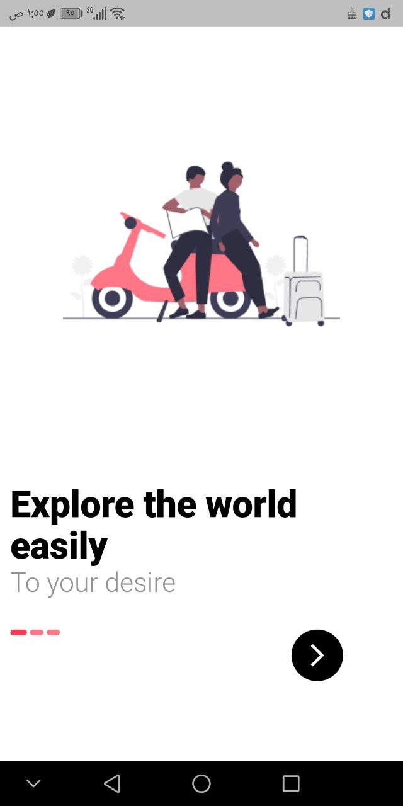
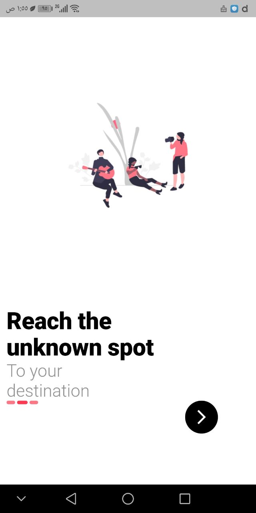
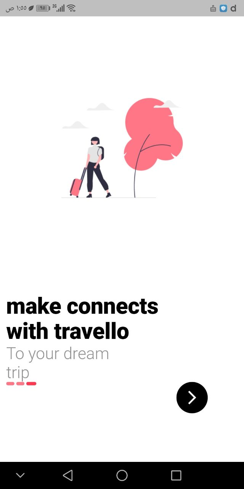
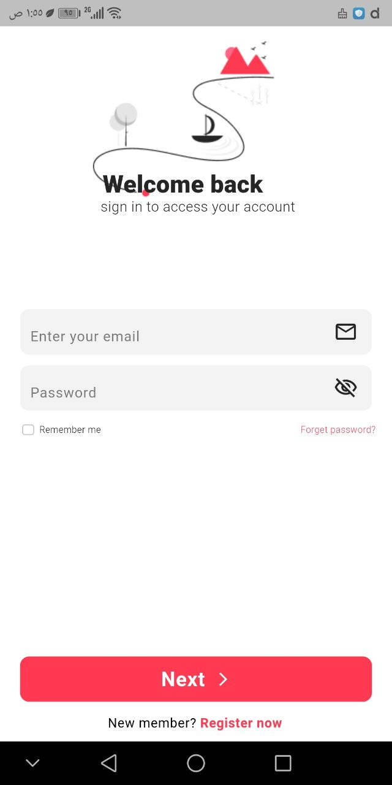
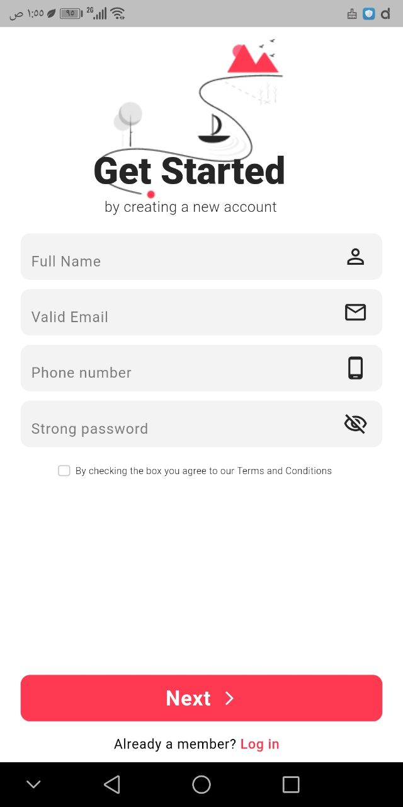
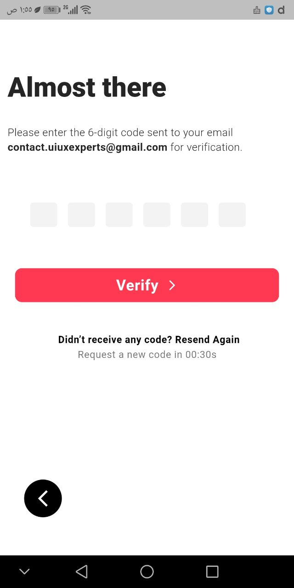
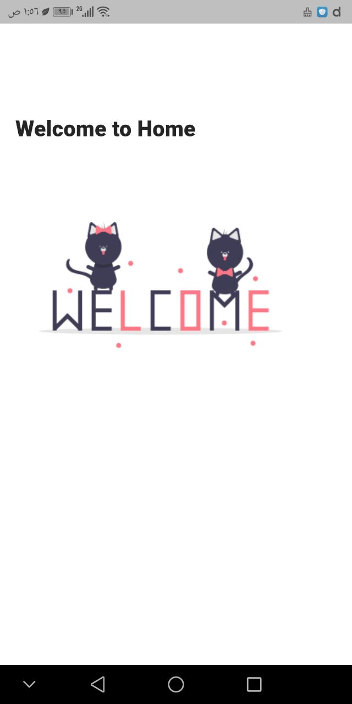

# Travello - Modern Travel UI 

A premium, high-fidelity mobile application UI built with **Flutter**. This project demonstrates professional UI implementation, focusing on pixel-perfect accuracy from Figma designs, smooth transitions, and clean, modular code.

## Repository Link
[https://github.com/Ayaezz1101/task2](https://github.com/Ayaezz1101/task2)

## Key Features
* **Fully Responsive**: Built using `flutter_screenutil` to ensure a consistent experience across all screen sizes.
* **Smart Animations**: Custom `FadeRoute` transitions for a seamless user journey.
* **Reusable Components**: Highly modular architecture with custom widgets (TextFields, Buttons, OTP inputs).
* **Clean Architecture**: Clear separation between UI, theme, and logic.

## Tech Stack
* **Framework**: Flutter SDK
* **Language**: Dart
* **Environment**: Developed on Windows via  & VS Code.

## Application Screenshots

### Splash & Onboarding
| Splash Screen | Step 1 | Step 2 | Step 3 |
| :---: | :---: | :---: | :---: |
|  |  |  |  |

### Authentication Flow
| Sign In | Sign Up | OTP Verification | Welcome Home |
| :---: | :---: | :---: | :---: |
|  |  |  |  |

## Installation

Follow these steps to run the project locally:

1.  **Clone the repository**:
    ```bash
    git clone [https://github.com/Ayaezz1101/task2.git](https://github.com/Ayaezz1101/task2.git)
    ```
2.  **Navigate to project directory**:
    ```bash
    cd task2
    ```
3.  **Install dependencies**:
    ```bash
    flutter pub get
    ```
4.  **Run the app**:
    ```bash
    flutter run
    ```

## Project Structure
```text
lib/
├── data/          # Onboarding content models
├── theme/         # Global AppTheme and color constants
├── services/      # Custom PageRoute transitions
├── widgets/       # Reusable components (CustomTextField, PrimaryButton, OTPBox)
└── pages/         # Screen implementations (Splash, Onboarding, Sign In, Sign Up, Verify, Home)
